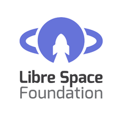

# SDR Radiation Resistance evaluation

The goal of this activity is to evaluate the radiation resistance of common SDR architectures. 

The activity will be conducted in two steps:
1. Identify the key hardware components of commodity SDR hardware and characterize their radiation immunity
2. Conduct experiments with a goal to:
    - Quantify the expected results 
    - Identify RF performance degredation under radiation exposure 
    - Propose simple and cost effective techniques to mitigate, in some part, the radiation impairements

For more information, you can visit the [wiki](https://gitlab.com/librespacefoundation/sdrmakerspace/radtest/wikis/home)

## Website
This module is part of the SDR Makerspace project of the European Space Agency (ESA),
implemented by Libre Space Foundation (LSF).
For more indormation please visit our [site](https://libre.space).

## License

 

   
